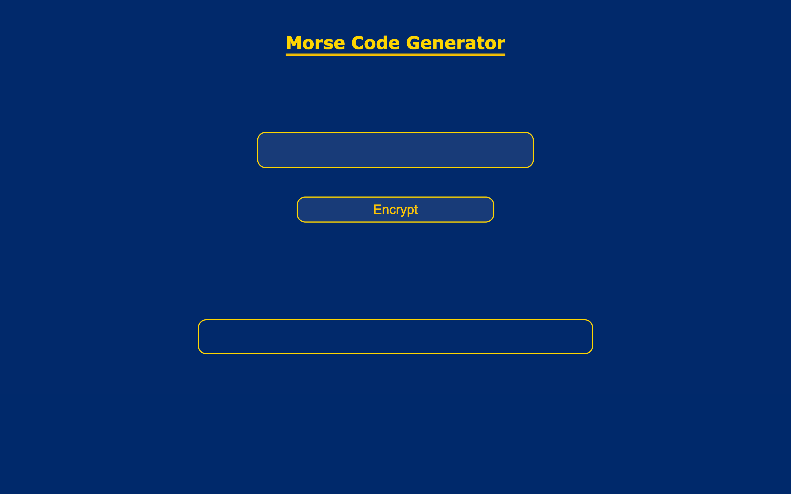

# Project Project Morse Code

A practical project for Supercode Fullstack Web-Dev Bootcamp. The goal ist to learn and practice the functions of Loops in Javascript. 

## Demo
You can check the result out in the following video:

https://youtu.be/XK-h9e2nTEs

## Deployment

To check this project out click the link below

https://samuelaliyari.github.io/Project-Morse-Code/

## Tech Stack

**Client:** HTML, SCSS, Javascript

**Server:** Github Pages

## Authors

- [@Samuel Aliyari](https://github.com/samuelaliyari)

## Screenshot

